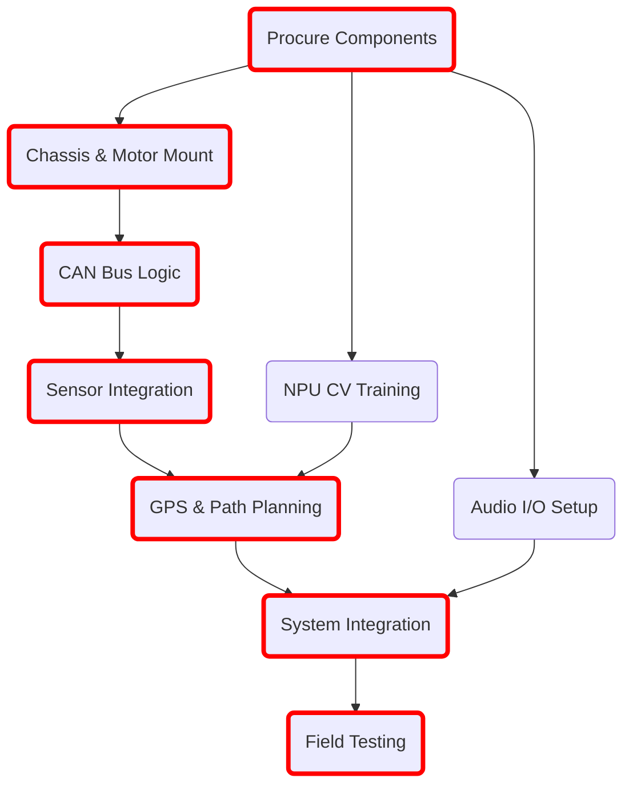

# Senior-Design: Autonomous Service Robot

## 1. Critical Path Method Strategy

```mermaid
graph TD
    A(Procure Components) --> B(Chassis & Motor Mount)
    A --> E(NPU CV Training)
    A --> F(Audio I/O Setup)
    B --> C(CAN Bus Logic)
    C --> D(Sensor Integration)
    D --> G(GPS & Path Planning)
    E --> G
    G --> H(System Integration)
    F --> H
    H --> I(Field Testing)

    style A stroke:#f00,stroke-width:4px
    style B stroke:#f00,stroke-width:4px
    style C stroke:#f00,stroke-width:4px
    style D stroke:#f00,stroke-width:4px
    style G stroke:#f00,stroke-width:4px
    style H stroke:#f00,stroke-width:4px
    style I stroke:#f00,stroke-width:4px
```

